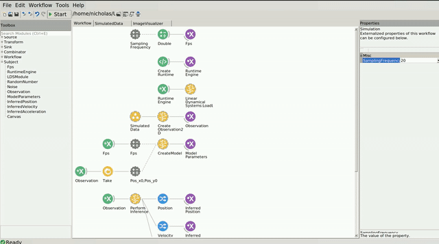

# Simulated Data

The code for this repo can be found [here](https://github.com/bonsai-rx/machinelearning-examples/tree/main/examples/LinearDynamicalSystems/Kinematics/SimulatedData).

In the following example, you can find how the Kalman Filter can be used for kinematic inference using simulated data.

### Dependencies

If you used the bootstrapping method, you dont have to worry about the package dependencies, as these should be already installed. However, if creating a new environment or integrating into an existing one, you will need to install the following packages:

* Bonsai - Core v2.8.1
* Bonsai - Design v2.8.0
* Bonsai - Editor v2.8.0
* Bonsai - ML v0.1.0
* Bonsai - ML LinearDynamicalSystems v0.1.0
* Bonsai - ML Visualizers v0.1.0
* Bonsai - Numerics v0.9.0
* Bonsai - Scripting v2.8.0
* Bonsai - Scripting Python v0.2.0
* Bonsai - System v2.8.0
* Bonsai - Vision v2.8.1
* Bonsai - Vision Design v2.8.0

### Workflow

Below is the workflow for running the Kalman Filter Kinematics model on simulated data.

:::workflow

:::

In this example, we created a Kalman Filter for infering kinematics from simulated data. We created a property called `SamplingFrequency` which dictates both the time step parameter of our model and also determines the rate at which the new simulated data values are generated.

At each time step, the `Timer` inside the `SimulatedData` group workflow emits a new value which increments by 1. This value is then transformed by the `Sin` and `Cos` functions to generate points along the circumference of a circle. Noise is added to the values by sampling from a normal distribution and the output of this gets scaled and transformed to map onto pixel coordinates in an image of size 500 x 500. These values are then converted into observations that are then passed to the model to perform inference.

To see the inferred kinematics of the model, double click on the `SimulatedDataVisualizer` node at the bottom of the workflow while it is running to open up the visualizer. On the left, you should see the inferred position, velocity and acceleration (top to bottom), with the ability to select which state component (X or Y) you want to visualize from the dropdown menu on the top right corner of the graph. Both the mean (dark blue) and variance (light blue shading) of the inferred state component are visualized. On the right, you should see an image representing the location of each new observation (blue) along with the inferred position of the model over time (red).

The window should look similar to this:

