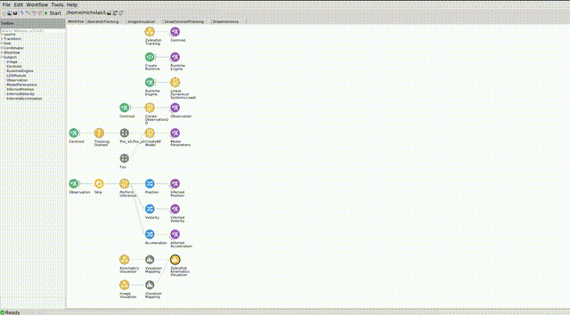

# Zebrafish Centroid Tracking

In the following example, you can find how the Kalman Filter can be used to infer the kinematics of a freely swimming juvenille zebrafish.

### Dataset

You can download the `ZebrafishExampleVid.avi` video file used in the example workflow [here](https://doi.org/10.5281/zenodo.10629221). The workflow expects the video to be placed into the `datasets` folder but if you prefer to keep the video elsewhere, simply change the `Filename` property of the `ZebrafishTracking` group node to point to the correct location.

### Workflow

Below is the workflow for inferring kinematics of zebrafish swimming.

:::workflow

:::

In this example, a Kalman Filter is used to infer the position, velocity, and acceleration of a freely swimming zebrafish. The original video was collected at 200 Hz, so the `Fps` property of the `CreateKFModel` node is set to 200. The workflow works by performing centroid tracking inside of the `ZebrafishTracking` node, which performs image analyses to extract the `Centroid` of the zebrafish. The `Centroid` data is then converted into a type of `Observation2D` that the model then uses to perform inference using the  `PerformInference` node. 

To visualize the inferred position, velocity, and acceleration kinematics, double click on the `ZebrafishKinematicsVisualizer` node at the bottom of the workflow while it is running to open up the visualizer. On the left, you should see the inferred position, velocity and acceleration (top to bottom), with the ability to select which state component (X or Y) you want to visualize from the dropdown menu on the top right corner of the graph. Both the mean (dark blue) and variance (light blue shading) of the inferred state component are visualized. On the right, you should see the video of the zebrafish playing, with the original tracking data (blue) and inferred position (red) overlaid.

